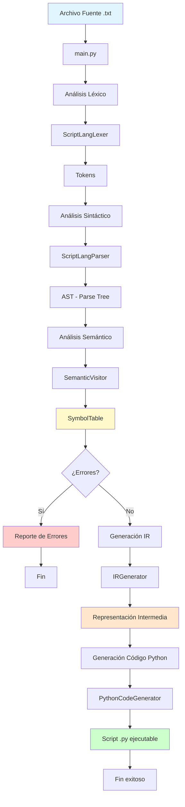

# CompiladoresFinal

# Test válido
python main.py tests/test01_basico.txt out1.py
python out1.py

python main.py tests/test02_multiple.txt out2.py
python out2.py

# Test error
python main.py tests/error01_inexistente.txt

python main.py tests/error02_duplicada.txt

# Test Automaticos
python run_tests.py

# Documentación Técnica - Mini-Compilador ScriptLang
# Proyecto Final - Compiladores

Integrantes: Juan David Moncayo, Maria Valentian Vasquez
Tema: Lenguaje para guiones interactivos (Tema #9)

---

# Tabla de Contenido

1. [Introducción](#1-introducción)
2. [Diseño del Lenguaje](#2-diseño-del-lenguaje)
3. [Gramática ANTLR4](#3-gramática-antlr4)
4. [Análisis Léxico](#4-análisis-léxico)
5. [Análisis Sintáctico](#5-análisis-sintáctico)
6. [Análisis Semántico](#6-análisis-semántico)
7. [Generación de Código Intermedio](#7-generación-de-código-intermedio)
8. [Traducción a Python](#8-traducción-a-python)
9. [Arquitectura del Compilador](#9-arquitectura-del-compilador)
10. [Casos de Prueba](#10-casos-de-prueba)
11. [Problemas Encontrados y Soluciones](#11-problemas-encontrados-y-soluciones)
12. [Conclusiones](#12-conclusiones)

---

# 1. Introducción

# 1.1 Objetivo
Desarrollar un mini-compilador completo para un lenguaje de guiones interactivos que permita definir escenas con diálogos y opciones de navegación, traduciendo estos scripts a código Python ejecutable.

# 1.2 Alcance
El compilador implementa todas las fases de compilación:
- Análisis léxico y sintáctico mediante ANTLR4
- Análisis semántico con tabla de símbolos
- Generación de representación intermedia (IR)
- Traducción final a scripts Python ejecutables

---

# 2. Diseño del Lenguaje

# 2.1 Especificación Formal

ScriptLang: es un lenguaje diseñado para crear guiones interactivos con estructura de grafo dirigido, donde cada nodo es una escena que contiene diálogos y opciones de navegación.

# 2.2 Palabras Clave
- `escena`: Define una escena/nodo del guión
- `decir`: Muestra un mensaje al usuario
- `opcion`: Presenta una opción interactiva
- `ir_a`: Indica la escena destino

# 2.3 Sintaxis General
```
program     : scene+ EOF
scene       : 'escena' ID '{' dialogue+ '}'
dialogue    : sayStmt | optionStmt
sayStmt     : 'decir' STRING ';'
optionStmt  : 'opcion' STRING 'ir_a' ID ';'
```

# 2.4 Reglas Semánticas
1. Todas las escenas deben tener un nombre único
2. Las referencias en `ir_a` deben apuntar a escenas existentes
3. Cada escena debe contener al menos un diálogo
4. Los identificadores siguen el patrón: `[a-zA-Z_][a-zA-Z_0-9]*`

# 2.5 Ejemplo Válido
```
escena inicio {
    decir "Bienvenido al juego";
    opcion "Comenzar" ir_a nivel1;
}

escena nivel1 {
    decir "Estás en el nivel 1";
    opcion "Continuar" ir_a nivel2;
}

escena nivel2 {
    decir "Nivel completado";
}
```

---

# 3. Gramática ANTLR4

# 3.1 Archivo ScriptLang.g4 Completo
```antlr
grammar ScriptLang;

// Reglas sintácticas
program : scene+ EOF ;
scene : 'escena' ID '{' dialogue+ '}' ;
dialogue : sayStmt | optionStmt ;
sayStmt : 'decir' STRING ';' ;
optionStmt : 'opcion' STRING 'ir_a' ID ';' ;

// Reglas léxicas
ID : [a-zA-Z_][a-zA-Z_0-9]* ;
STRING : '"' (~["\r\n])* '"' ;
WS : [ \t\r\n]+ -> skip ;
LINE_COMMENT : '//' ~[\r\n]* -> skip ;
BLOCK_COMMENT : '/*' .*? '*/' -> skip ;
```

# 3.2 Decisiones de Diseño
- Tokens literales vs keywords: Usamos tokens literales ('escena', 'decir') para simplicidad
- Comentarios: Soportamos comentarios de línea (`//`) y bloque (`/* */`)
- Strings: Definidos con comillas dobles, no permiten saltos de línea
- Precedencia: No hay operadores, por lo que no se requieren reglas de precedencia

---

# 4. Análisis Léxico

# 4.1 Tokens Identificados
| Token | Tipo | Descripción |
|-------|------|-------------|
| `escena` | Keyword | Inicio de definición de escena |
| `decir` | Keyword | Comando de diálogo |
| `opcion` | Keyword | Comando de opción |
| `ir_a` | Keyword | Indicador de destino |
| `{`, `}` | Delimitador | Bloques de escena |
| `;` | Delimitador | Fin de instrucción |
| ID | Identificador | Nombres de escenas |
| STRING | Literal | Texto entre comillas |

# 4.2 Manejo de Espacios en Blanco
Los espacios, tabulaciones y saltos de línea se ignoran mediante la regla `WS -> skip`.

# 4.3 Errores Léxicos Detectados
- Strings sin cerrar
- Caracteres inválidos
- Identificadores que comienzan con números

---

# 5. Análisis Sintáctico

# 5.1 Árbol de Sintaxis Abstracta (AST)
El parser de ANTLR genera un árbol de análisis sintáctico con la siguiente estructura:

```
ProgramContext
├── SceneContext (escena inicio)
│   ├── ID: "inicio"
│   └── DialogueContext[]
│       ├── SayStmtContext
│       └── OptionStmtContext
└── SceneContext (escena juego)
    └── ...
```

# 5.2 Recuperación de Errores
ANTLR implementa recuperación automática de errores sintácticos, permitiendo detectar múltiples errores en una sola pasada.

# 5.3 Errores Sintácticos Detectados
- Falta de punto y coma
- Llaves sin cerrar/abrir
- Palabras clave mal escritas
- Secuencia inválida de tokens

---

# 6. Análisis Semántico

# 6.1 Tabla de Símbolos

# 6.1.1 Estructura
```python
class SymbolTable:
    scenes: Dict[str, Symbol]
    
    - add_scene(name: str) -> bool
    - scene_exists(name: str) -> bool
```

# 6.1.2 Información Almacenada
- Nombre de cada escena declarada
- Tipo de símbolo: 'scene'

# 6.2 Verificaciones Semánticas

# Primera Pasada: Recolección de Símbolos
1. Recorrer todas las escenas
2. Agregar cada escena a la tabla de símbolos
3. Detectar escenas duplicadas

# Segunda Pasada: Verificación de Referencias
1. Examinar todas las opciones `ir_a`
2. Verificar que la escena destino exista
3. Reportar referencias a escenas inexistentes

# 6.3 Mensajes de Error Semántico
```
[Línea X] Error: Escena 'nombre' duplicada
[Línea Y] Error: Escena 'destino' no existe
```

# 6.4 Código del SemanticVisitor
```python
class SemanticVisitor(ScriptLangVisitor):
    def visitProgram(self, ctx):
        # Primera pasada: registrar escenas
        for scene_ctx in ctx.scene():
            scene_name = scene_ctx.ID().getText()
            if not self.table.add_scene(scene_name):
                self.error(scene_ctx, f"Escena '{scene_name}' duplicada")
        
        # Segunda pasada: verificar referencias
        for scene_ctx in ctx.scene():
            self.visitScene(scene_ctx)
```

---

# 7. Generación de Código Intermedio

# 7.1 Representación Intermedia (IR)

# 7.1.1 Estructura de IR
```python
class IRInstruction:
    op: str      # Operación: "PRINT", "OPTION"
    arg1: any    # Primer argumento
    arg2: any    # Segundo argumento (opcional)
```

# 7.1.2 Operaciones Definidas
- `PRINT(texto)`: Imprime un mensaje
- `OPTION(texto, destino)`: Opción interactiva

# 7.2 Ejemplo de IR Generado
Para el código:
```
escena inicio {
    decir "Hola";
    opcion "Ir" ir_a fin;
}
```

Se genera:
```json
{
  "scenes": {
    "inicio": [
      IRInstruction("PRINT", "Hola"),
      IRInstruction("OPTION", "Ir", "fin")
    ]
  },
  "first_scene": "inicio"
}
```

# 7.3 Clase IRGenerator
```python
class IRGenerator(ScriptLangVisitor):
    def visitScene(self, ctx):
        scene_name = ctx.ID().getText()
        self.scenes[scene_name] = []
        
        for dialogue_ctx in ctx.dialogue():
            if dialogue_ctx.sayStmt():
                text = dialogue_ctx.sayStmt().STRING().getText()[1:-1]
                self.scenes[scene_name].append(IRInstruction("PRINT", text))
            elif dialogue_ctx.optionStmt():
                # Procesar opción...
```

---

# 8. Traducción a Python

# 8.1 Mapeo IR → Python

| IR | Python Generado |
|----|-----------------|
| `PRINT(texto)` | `print("texto")` |
| `OPTION(texto, destino)` | `opcion = input("texto -> ")`<br>`if opcion.strip():`<br>`    destino()` |

# 8.2 Estructura del Código Generado
```python
# Guión interactivo generado

def escena1():
    print("Mensaje")
    opcion = input("Opción -> ")
    if opcion.strip():
        escena2()

def escena2():
    print("Otro mensaje")

if __name__ == '__main__':
    escena1()  # Inicia en primera escena
```

### 8.3 Características del Código Python
- Cada escena se traduce a una función
- Las opciones llaman directamente a las funciones destino
- La primera escena declarada se ejecuta automáticamente
- Código independiente y ejecutable

---

# 9. Arquitectura del Compilador

# 9.1 Diagrama de Componentes (Mermaid)



# 9.2 Módulos del Sistema

# 9.2.1 generated/
Contiene archivos generados por ANTLR:
- `ScriptLangLexer.py`: Analizador léxico
- `ScriptLangParser.py`: Analizador sintáctico
- `ScriptLangVisitor.py`: Patrón visitor para recorrer AST

# 9.2.2 semantic_analyzer/
- `SymbolTable.py`: Gestión de símbolos
- `SemanticVisitor.py`: Verificación semántica

# 9.2.3 code_generator/
- `IRGenerator.py`: Generación de IR
- `PythonCodeGenerator.py`: Traducción a Python

# 9.2.4 main.py
Orquestador principal que conecta todas las fases.

# 9.3 Flujo de Datos
1. Entrada: Archivo `.txt` con código ScriptLang
2. Léxico: Conversión a stream de tokens
3. Sintáctico: Construcción del AST
4. Semántico: Validación y construcción de tabla de símbolos
5. IR: Representación intermedia independiente del lenguaje
6. Salida: Script Python ejecutable

---

# 10. Casos de Prueba

# 10.1 Pruebas Válidas (10 casos)

| # | Archivo | Descripción | Características |
|---|---------|-------------|-----------------|
| 1 | test01_basico.txt | Flujo simple | 2 escenas, 1 opción |
| 2 | test02_multiple.txt | Múltiples opciones | 3 escenas, 2 opciones |
| 3 | test03_cadena.txt | Secuencia lineal | 3 escenas encadenadas |
| 4 | test04_dialogos.txt | Múltiples diálogos | Varios `decir` por escena |
| 5 | test05_loop.txt | Ciclos | Navegación circular |
| 6 | test06_underscores.txt | IDs con _ | nivel_1, nivel_2 |
| 7 | test07_numeros.txt | IDs con números | nivel1, nivel2 |
| 8 | test08_comentarios.txt | Comentarios | `//` y `/* */` |
| 9 | test09_especiales.txt | Chars especiales en strings | @, #, $, % |
| 10 | test10_complejo.txt | Bifurcación | Grafo con múltiples rutas |

### 10.2 Pruebas con Errores (10 casos)

| # | Archivo | Tipo Error | Descripción |
|---|---------|------------|-------------|
| 1 | error01_inexistente.txt | Semántico | Referencia a escena no declarada |
| 2 | error02_duplicada.txt | Semántico | Escena declarada dos veces |
| 3 | error03_sin_punto_coma.txt | Sintáctico | Falta `;` en `decir` |
| 4 | error04_sin_punto_coma2.txt | Sintáctico | Falta `;` en `opcion` |
| 5 | error05_sin_llave_abre.txt | Sintáctico | Falta `{` |
| 6 | error06_sin_llave_cierra.txt | Sintáctico | Falta `}` |
| 7 | error07_string_sin_cerrar.txt | Léxico | String sin comilla final |
| 8 | error08_typo.txt | Léxico/Sint. | Keyword mal escrito |
| 9 | error09_sin_nombre.txt | Sintáctico | Escena sin ID |
| 10 | error10_sin_string.txt | Sintáctico | `decir` sin argumento |

# 10.3 Ejemplo de Ejecución

# Caso Válido:
```bash
$ python main.py tests/test01_basico.txt out1.py

Compilando: tests/test01_basico.txt
✓ Sin errores semánticos
✓ Generado: out1.py

$ python out1.py
Bienvenido
Comenzar -> sí
Nivel 1
```

# Caso con Error:
```bash
$ python main.py tests/error01_inexistente.txt

Compilando: tests/error01_inexistente.txt
✓ Sin errores semánticos

Errores semánticos:
  [Línea 3] Error: Escena 'noexiste' no existe
```

# 10.4 Resultados de Pruebas Automatizadas
```
PRUEBAS VÁLIDAS: 10/10 exitosas
PRUEBAS CON ERRORES: 10/10 detectadas correctamente
TASA DE ÉXITO: 100%
```

---

# 11. Problemas Encontrados y Soluciones

# 11.1 Problema: Verificación de Referencias Circulares
Descripción: El lenguaje permite ciclos (escena A → B → A), lo cual es válido para guiones interactivos pero podría confundirse con un error semántico.

Solución: Solo verificamos que las escenas referenciadas existan, permitiendo explícitamente ciclos ya que son parte del diseño del lenguaje (menús que vuelven, loops de juego, etc.).

# 11.2 Problema: Orden de Declaración
Descripción: Inicialmente, una escena no podía referenciar a otra que se declarara después en el archivo.

Solución: Implementamos análisis en dos pasadas:
1. Primera pasada: Registrar todas las escenas
2. Segunda pasada: Verificar referencias

# 11.3 Problema: Strings Multilínea
Descripción: Los strings con saltos de línea causaban errores léxicos.

Solución: Definimos strings como `'"' (~["\r\n])* '"'`, prohibiendo explícitamente saltos de línea dentro de strings.

# 11.4 Problema: Ejecución del Script Generado
Descripción: Los scripts generados entraban en loop infinito con opciones.

Solución: Agregamos verificación `if opcion.strip():` para que solo se ejecute la transición si el usuario ingresa algo, permitiendo salir con Enter vacío.

# 11.5 Problema: Primera Escena a Ejecutar
Descripción: No quedaba claro cuál escena iniciar al ejecutar el script.

Solución: La primera escena declarada en el archivo es automáticamente la escena inicial, marcada en el IR como `first_scene`.

---

# 12. Conclusiones

# 12.1 Logros Alcanzados
✅ Compilador completo funcional con todas las fases implementadas  
✅ Gramática ANTLR4 robusta y bien documentada  
✅ Análisis semántico con tabla de símbolos  
✅ Generación de código Python ejecutable  
✅ 20 casos de prueba exitosos (10 válidos + 10 errores)  
✅ Mensajes de error claros y pedagógicos  
✅ Código modular y escalable  

# 12.2 Aprendizajes
- Diseño e implementación de un lenguaje de dominio específico (DSL)
- Uso profesional de ANTLR4 para generación de parsers
- Implementación de análisis semántico con múltiples pasadas
- Patrones de diseño Visitor para recorrer ASTs
- Generación de código destino desde representación intermedia

# 12.3 Posibles Mejoras Futuras
- Variables y expresiones aritméticas
- Condiciones booleanas para opciones
- Sistema de inventario (variables de estado)
- Importación de escenas desde otros archivos
- Optimización del código Python generado
- Generación de salidas alternativas (JavaScript, bytecode)

# 12.4 Aplicabilidad
Este compilador puede usarse para:
- Crear juegos de texto/aventuras interactivas
- Sistemas de tutoriales guiados
- Chatbots con flujos predefinidos
- Herramientas educativas interactivas
- Prototipos de diálogos para videojuegos

---

# Anexos

# A. Instalación y Uso

#### Requisitos
- Python 3.8+
- ANTLR4 (`pip install antlr4-python3-runtime`)

## Compilar un archivo
```bash
python main.py entrada.txt salida.py
python salida.py
```

# Ejecutar todas las pruebas
```bash
python run_tests.py
```

# B. Estructura del Proyecto
```
CompiladoresFinal/
├── main.py
├── run_tests.py
├── ScriptLang.g4
├── generated/
│   ├── ScriptLangLexer.py
│   ├── ScriptLangParser.py
│   └── ScriptLangVisitor.py
├── semantic_analyzer/
│   ├── SymbolTable.py
│   └── SemanticVisitor.py
├── code_generator/
│   ├── IRGenerator.py
│   └── PythonCodeGenerator.py
├── tests/
│   ├── test01_basico.txt ... test10_complejo.txt
│   └── error01_inexistente.txt ... error10_sin_string.txt
└── doc_proyecto.docx
```


Fin del Documento